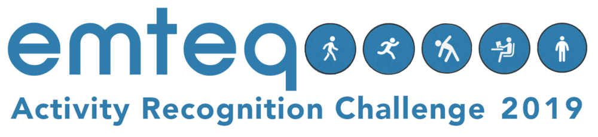
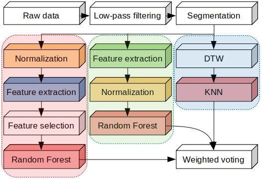
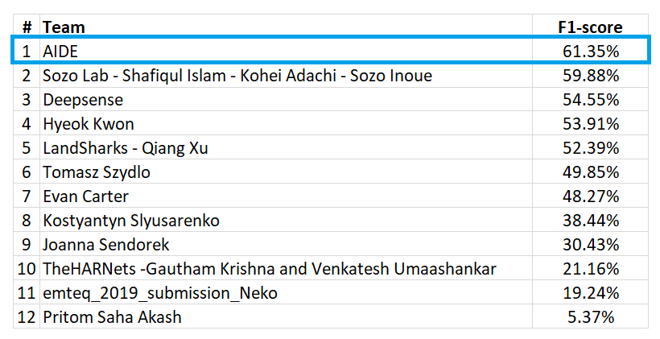
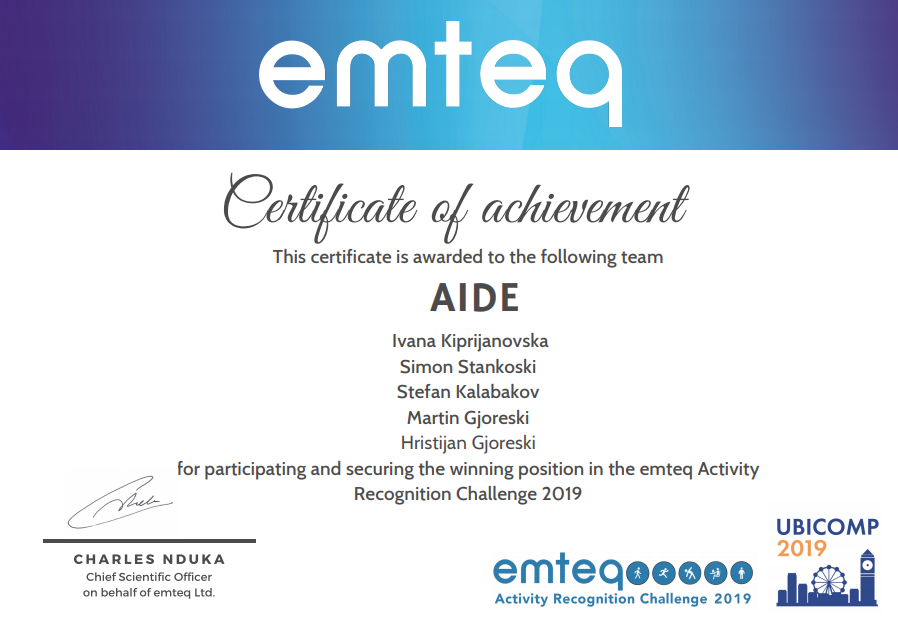

# Emteq ARC2019

[Emteq](https://emteq.net/) organized [Human Activty Recognition Challenge 2019](https://emteq.net/arc2019). The goal of the challenge was to recognize eight activities of daily life from a devicemounted on the head, which provides data from three-axis IMU: accelerometer,gyroscope and magnetometer.

# Dataset

  - There are 4 persons' data. 3 persons' data is used as train data and 4th person's data is used as test data
  - Dataset download Link : [Emteq Dataset](https://www.dropbox.com/sh/55mtslq8lb4q6w3/AABL1H_9bdZG5XAAdQR-0W8qa?dl=0)

# Our method

# Prize

  - Our team won the 1st place.  
  

# Team members

  

